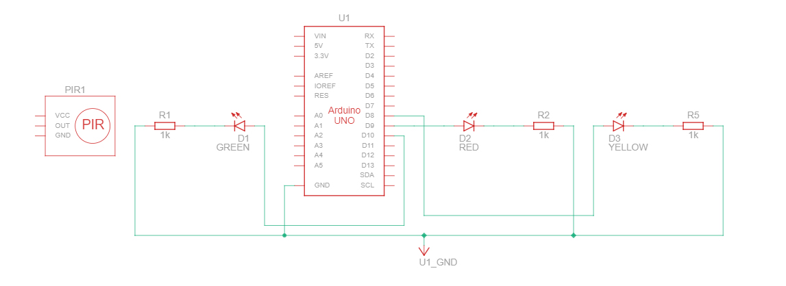

### Hello

    A GUIs based application that can turn on/off led using python with 
    tkinter and pyfirmata.

### Requirements

+ Python 3.10+
+ Pyfirmata
+ Tkinter
+ Arduino kit

### Schematic View

### Circuit View

